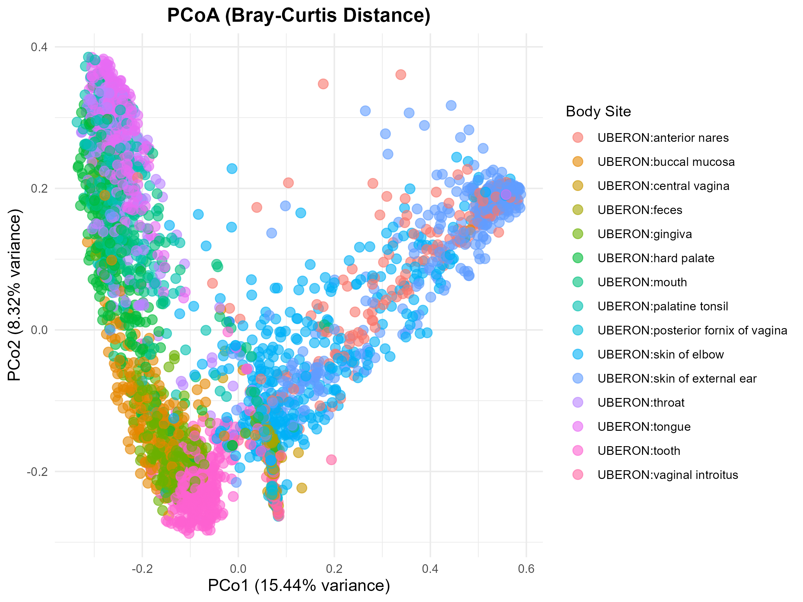
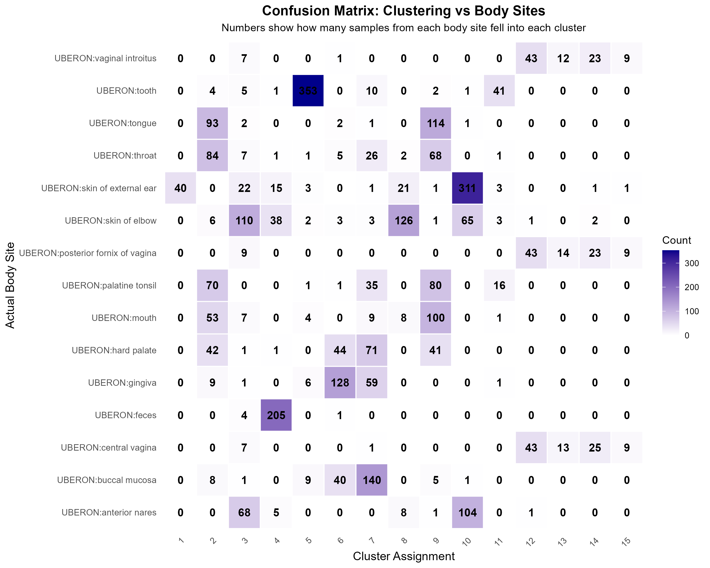
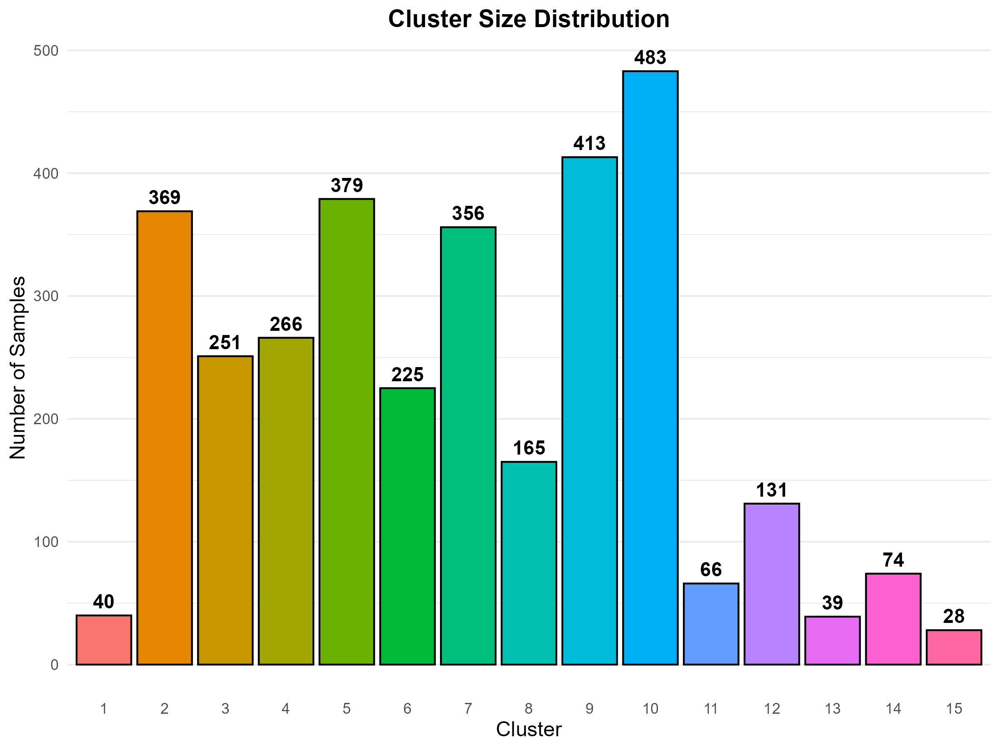
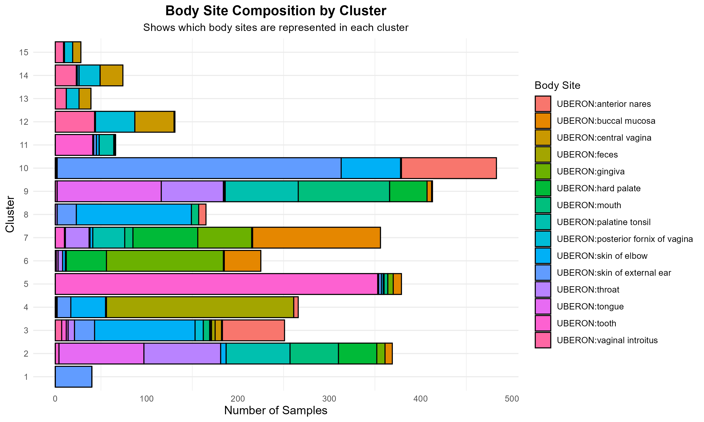
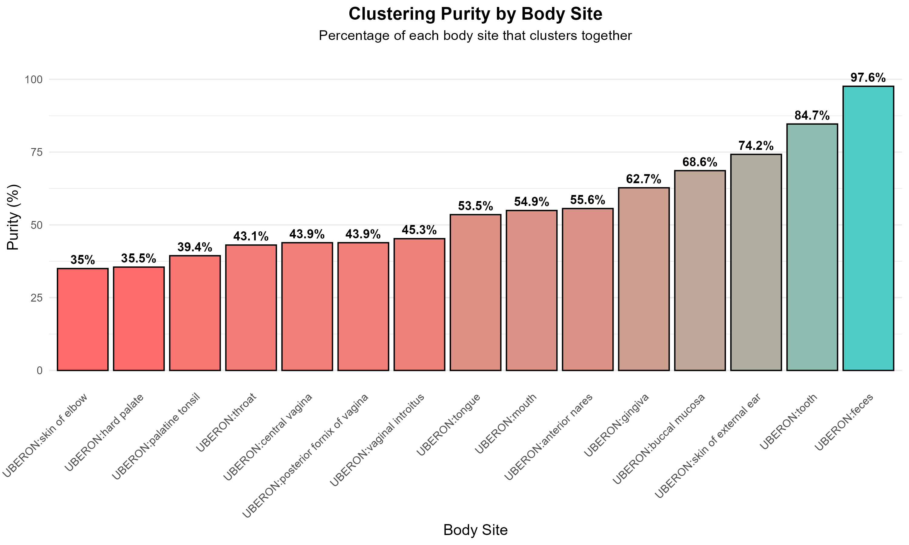

# Unsupervised Learning of Microbial Community Structure by Body Site

**Author:** Nkiruka Cynthia Efenji  
**Dataset:** HMPv13; Human Microbiome Project (16S rRNA, V1–V3 region)  
**Tools:** R · phyloseq · vegan · ggplot2 · here · dplyr · reshape2 · cmdscale · hclust/cutree  
**Project type:** Exploratory bioinformatics · Unsupervised machine learning  


---

## Background and Motivation

The human body is not a single environment. Every surface; skin, gut, mouth, vaginal tract,
nasal passages, hosts a microbial community shaped by the local conditions it lives in: pH,
oxygen availability, nutrient composition, immune pressure. The **Human Microbiome Project (HMP)**
characterised these communities across healthy adults using 16S rRNA amplicon sequencing,
producing one of the most comprehensive human microbiome reference datasets in existence.

This project applies unsupervised learning to ask a deceptively simple question:

> *Without being told where a sample came from, can the microbial data alone recover body-site identity?*

If the answer is yes...if microbial communities are sufficiently site-specific to cluster
without supervision...it validates the ecological principle of **niche specificity** and has
direct implications for microbiome based diagnostics, antimicrobial resistance (AMR)
surveillance, and clinical interpretation of microbiome data.

---

## Dataset

| Feature | Detail |
|---|---|
| Source | `MicrobeDS` R package - `HMPv13` object |
| Sequencing | 16S rRNA amplicon, V1–V3 hypervariable region |
| Samples | 3,285 samples |
| Body sites | 15 UBERON-annotated anatomical sites |
| Taxonomic level | OTU (Operational Taxonomic Units) |

**Body sites (UBERON ontology):**

anterior nares · buccal mucosa · central vagina · feces · gingiva · hard palate · mouth ·
palatine tonsil · posterior fornix of vagina · skin of elbow · skin of external ear ·
throat · tongue · tooth · vaginal introitus

UBERON (Uber Anatomy Ontology) standardises body site terminology across databases and
species, ensuring that results from this analysis are comparable with microbiome studies
globally. This is a core open science principle.

---

## Analytical Workflow

```
HMPv13 phyloseq object
        │
        ▼
  Data exploration
  (ntaxa, nsamples, body site distribution)
        │
        ▼
  OTU table extraction + transpose
  (samples as rows, OTUs as columns)
        │
        ▼
  Prevalence filtering
  (remove OTUs with total count ≤ 10)
        │
        ▼
  Relative abundance normalisation
  (each sample sums to 1)
        │
        ▼
  Log transformation — log1p(relative abundance)
  (stabilise variance, reduce skew)
        │
        ▼
  Bray-Curtis dissimilarity matrix
  (3,285 × 3,285 pairwise distances — vegan::vegdist)
        │
        ├─────────────────────────────────────────┐
        ▼                                         ▼
  PCoA — cmdscale(k=2)                Hierarchical clustering
  2D projection of community           hclust(ward.D2), k=15
  structure (Plot A)                        │
                                     ┌──────┴──────────────────────┐
                                     ▼              ▼              ▼
                              Confusion       Cluster size    Purity
                              matrix          distribution    metric
                              heatmap         (Plot C)        (Plot E)
                              (Plot B)
                                     ▼
                              Body site composition
                              by cluster (Plot D)
```

---

## Methods

### Preprocessing

Raw OTU count data from 3,285 samples required three preprocessing steps before any distance 
calculation:

**1. Prevalence filtering** - OTUs with a total count ≤ 10 across all samples were removed. 
This eliminates low-abundance taxa that contribute noise rather than biological signal, and 
reduces dimensionality before distance computation.

**2. Relative abundance normalisation** - Each sample's counts were divided by its total count, 
converting raw reads to proportions. This is essential because samples were sequenced at 
different depths: a count of 500 reads of taxon X means something very different in a sample 
with 1,000 total reads versus one with 50,000.

**3. Log transformation** -  `log1p()` (i.e., log(x + 1)) was applied to relative abundance 
values. Microbiome data is heavily right-skewed — most taxa are rare, a few are very abundant.
Log transformation compresses this skew and stabilises variance, improving the performance of
both distance metrics and clustering.


### Beta Diversity - Bray-Curtis Dissimilarity

Beta diversity quantifies how different microbial communities are *between* samples.
**Bray-Curtis dissimilarity** was chosen because it:

- Is bounded between 0 (identical communities) and 1 (completely different)
- Accounts for both presence/absence *and* relative abundance of taxa
- Is robust to the compositional nature of sequencing count data
- Is the standard metric used in the original HMP papers and across human microbiome literature

The full 3,285 × 3,285 distance matrix was computed using `vegan::vegdist()` and saved as
an `.rds` object, enabling reuse across downstream scripts without recomputation.


### Dimensionality Reduction - PCoA

With thousands of OTUs and 3,285 samples, the data cannot be directly visualised.

**Principal Coordinates Analysis (PCoA)** - metric multidimensional scaling, takes the
Bray-Curtis distance matrix and projects it into 2D while preserving as much of the original
distance structure as possible.

Computed using `cmdscale(k = 2, eig = TRUE)`. The eigenvalues were used to calculate the
percentage of total variance explained by each axis:

- **PCo1: 15.44%** - primarily separates skin from mucosal communities

- **PCo2: 8.32%** - further separates vaginal from oral communities within the mucosal group
  
- **Combined: 23.76%** - typical for high-dimensional microbiome data, where variance is
  genuinely distributed across many biological axes
  

### Hierarchical Clustering - Ward.D2

**Hierarchical clustering** builds a tree by iteratively merging the most similar samples.
**Ward.D2 linkage** minimises total within-cluster variance at each merge step, making it
well suited for microbiome data where ecologically coherent clusters are expected to be
compact and well separated.

The number of clusters was set to **k = 15**, matching the number of body sites, to test 
whether the algorithm recovers biologically meaningful groupings without access to metadata.
Note that k=15 is an assumption rather than an empirically optimised choice, silhouette 
analysis to determine optimal k is planned for Phase 2.


### Cluster Evaluation - Purity Metric

To evaluate whether recovered clusters correspond to real body-site groupings, a
**purity score** was computed for each body site.

A purity of 100% means every sample from that body site was assigned to a single cluster. 
This is a standard unsupervised learning evaluation metric requiring only cluster assignments 
and known ground truth, no predicted class labels needed.


---

## Results

### Plot A - PCoA: Bray-Curtis Distance



Each point is one sample; colour indicates body site. Body site labels are applied post-hoc 
the ordination is driven entirely by microbial composition.

**Key observations**:

- **Oral sites** (mouth, gingiva, hard palate, tongue, palatine tonsil, buccal mucosa, tooth) 
  form the largest, densest mass on the left side of the plot, visually dominant but 
  internally mixed, reflecting genuine ecological heterogeneity across oral sub-sites.
  
- **Vaginal sites** (central vagina, posterior fornix, vaginal introitus) form the tightest, 
  most compact cluster, the distinct pink blob at the lower centre. High community convergence 
  driven by Lactobacillus dominance.

- **Skin sites** (elbow, external ear) extend as a distinct arm toward high PCo1 values 
  (right side), well-separated from mucosal communities.
  
- **Feces** sits in the middle of the plot with moderate separation, distinct from oral and
  skin but not as cleanly isolated as vaginal or skin communities.
  
- **Anterior nares** scatters broadly across the plot, overlapping with both skin and oral 
  regions, reflecting its transitional anatomy and high inter-individual variability.

Axis interpretation: PCo1 (15.44%) separates skin from mucosal communities. PCo2 (8.32%) 
separates vaginal from oral communities within the mucosal group.

---

### Plot B - Confusion Matrix Heatmap



This heatmap cross-tabulates cluster assignments (columns) against actual body site labels 
(rows). Darker cells = more samples at that intersection. A perfect algorithm would show one 
dominant dark cell per row.

**Key observations**:

- **Feces** is the cleanest result; 205 samples concentrate in cluster 4 with minimal scatter. 
  The gut microbiome is distinct enough that the algorithm isolates it unambiguously.

- **Skin of external ear** is similarly clean; cluster 10 captures 311 samples, the single 
  largest concentration in the entire matrix.

- **Vaginal sites** (central vagina, posterior fornix, vaginal introitus) fragment across the
  same clusters (11, 13, 14, 15) rather than one dominant cluster, but importantly, all three 
  co-cluster with each other, not with other body sites. The algorithm correctly identifies 
  them as ecologically related.
  
- **Oral sites** are the most fragmented; each sub-site distributes across 3–6 clusters, 
  reflecting genuine microenvironmental heterogeneity across tooth surfaces, hard palate, 
  and soft tissues.

- **Anterior nares** shares its dominant cluster (10) with skin of external ear; consistent 
  with the known overlap between nasal and skin-associated microbial communities.

Overall, the algorithm achieves clean separation for ecologically distinct sites (gut, skin) 
while honestly reflecting the community complexity of mucosal sites.

---

### Plot C — Cluster Size Distribution



This bar chart shows the number of samples assigned to each of the 15 Ward.D2 clusters.

**Key observations**:

- **Cluster sizes** are highly unequal, ranging from 28 samples (cluster 15) to 483 samples 
  (cluster 10), a 17 fold difference.

- **Cluster 10** is the largest (483), consistent with the confusion matrix where it dominates 
  skin of external ear and partially captures anterior nares and skin of elbow.

- **Clusters 1, 13, and 15** are the smallest (40, 39, 28), corresponding to the fragmented 
  vaginal site assignments from the confusion matrix.

- **Clusters 2-9** (165-413 samples) are large and variable, likely capturing the numerous but 
  ecologically heterogeneous oral site samples spread across multiple clusters.

- **Clusters 11-14** (66-131 samples) form a distinct small-to-mid tier, consistent with the 
  vaginal and mixed-site assignments seen in the confusion matrix.

Unequal cluster sizes are biologically expected, not a flaw. The HMP dataset is not balanced 
across body sites, and a good clustering algorithm recovers that natural imbalance rather than 
forcing artificial uniformity.


---

### Plot D — Body Site Composition by Cluster



This horizontal stacked bar chart shows which body sites contribute to each cluster. 
Single-colour dominance = high purity; multiple roughly equal colours = mixed membership.

**Key observations**:

**Cluster 1** achieves the highest purity among skin clusters, skin of elbow dominates almost 
  entirely with negligible contributions from other sites.

**Cluster 5** is the purest overall, tongue overwhelmingly dominates (~370 of ~380 samples), 
  with only negligible slivers of tooth and throat. The tongue microbiome is sufficiently 
  distinct to be cleanly isolated by the algorithm.

**Cluster 4** is feces-dominant, olive green accounts for the clear majority of the bar, 
  confirming the gut microbiome's compositional distinctiveness.
  
**Cluster 10** is the largest bar but moderately pure, skin of external ear dominates the 
  first ~380 samples but anterior nares contributes a substantial visible block, reflecting 
  the community overlap between nasal and skin associated microbiota.

**Cluster 8** captures a moderately pure skin of elbow signal, with palatine tonsil 
  contributing a visible but secondary portion.
  
**Clusters 12, 14, and 15** are the vaginal clusters, each contains a mix of central vagina, 
  posterior fornix, and vaginal introitus in varying proportions. The three vaginal sub-sites 
  consistently co-cluster with each other rather than with non-vaginal sites, confirming 
  ecological relatedness, but they do not resolve into a single pure cluster.

**Clusters 2, 6, 7, and 9** are the oral clusters, each dominated by different combinations 
  of throat, palatine tonsil, mouth, gingiva, hard palate, buccal mucosa, and tongue. The oral 
  cavity fragments across multiple clusters, reflecting genuine microenvironmental 
  heterogeneity across oral sub-sites.

**Cluster 3** is the least pure cluster in the entire analysis, skin of elbow, palatine 
  tonsil, anterior nares, and several other sites contribute in roughly equal proportions, 
  suggesting this cluster captures samples at the ecological boundaries between body site 
  communities.

Overall, the algorithm achieves clean isolation for tongue (cluster 5), feces (cluster 4), and 
skin of elbow (clusters 1 and 8), correctly groups vaginal sub-sites together, and honestly 
reflects the complexity of oral and transitional communities through fragmented, 
mixed membership clusters.

---

### Plot E — Clustering Purity by Body Site



This is the most analytically rigorous plot in the analysis. Purity is computed for each 
body site as the percentage of its samples assigned to that site's dominant cluster.
Body sites are ordered left to right by ascending purity score; colour encodes purity 
(red = lower, teal = higher).

**Key observations**:

**Feces** achieves the highest purity at 97.6%, nearly all gut samples concentrate in one 
  dominant cluster. This is the strongest signal in the entire analysis and confirms the gut 
  microbiome as the most compositionally distinct community across all 15 body sites.
  
**Tooth** (84.7%) and **skin of external ear** (74.2%) are the next highest, both representing
  specialised, low-overlap ecological niches (mineralised biofilm and dry skin surface 
  respectively).
  
**Buccal mucosa** (68.6%) and **gingiva** (62.7%) perform moderately well despite being oral 
  sites, suggesting these two sites have sufficiently distinct community compositions to be 
  partially recoverable by the algorithm.
  
**Anterior nares** (55.6%), **mouth** (54.9%), and **tongue** (53.5%) sit in the middle, above
  chance but reflecting meaningful overlap with neighbouring communities.
  
**Vaginal sites** score surprisingly low, central vagina (43.9%), posterior fornix (43.9%), 
  and vaginal introitus (45.3%). Despite their visual compactness in the PCoA, the algorithm 
  fragments them across multiple clusters, pulling their purity scores down. They cluster with
  each other but not into one dominant cluster.
  
**Skin of elbow** (35%) and **hard palate** (35.5%) are the lowest, the algorithm struggles
  most with these sites, consistent with cluster 3's mixed membership observed in Plot D.
  
**Throat** (43.1%) and **palatine tonsil** (39.4%) also score poorly, reflecting the 
  transitional nature of these anatomical sites and their overlap with neighbouring oral 
  communities.

The purity metric transforms this from a visualisation exercise into a machine learning 
evaluation. The result directly contradicts the visual impression from the PCoA, vaginal 
sites look tightly clustered but score poorly on purity because the algorithm over partitions
them. Feces, not vaginal sites, is the most algorithmically recoverable community in the human
microbiome dataset.

---

## Summary of Findings

| Body site group | PCoA position | Clustering purity | Biological interpretation |
|---|---|---|---|
| Feces | Intermediate, isolated | 97.6% | Unique anaerobic gut ecosystem, most compositionally distinct site |
| Tooth | Left side, oral mass | 84.7% | Mineralised biofilm environment distinct from soft-tissue oral sites |
| Skin of external ear | Upper right, high PCo1 | 74.2% | Low diversity, convergent skin community |
| Buccal mucosa | Left side, oral mass | 68.6% | Partially recoverable despite oral overlap |
| Gingiva | Left side, oral mass | 62.7% | Distinct enough within oral cavity to partially isolate |
| Vaginal sites | Tight lower-centre cluster | 43–45% | Co-cluster with each other but over-partitioned by algorithm at k=15 |
| Oral sites (remaining) | Left side, broad spread | 35–55% | Genuine microenvironmental heterogeneity across oral sub-sites |
| Skin of elbow | Upper right, high PCo1 | 35% | Mixed cluster membership, overlaps with transitional communities |
| Anterior nares | Scattered, transitional | 55.6% | Overlaps with skin and oral communities, high inter-individual variability |

**Headline result:** Feces, not vaginal sites, is the most algorithmically recoverable 
community in the dataset, achieving 97.6% purity. The PCoA visual impression and purity 
scores tell different stories about vaginal sites: they appear compact in ordination space 
but fragment across multiple clusters under Ward.D2 at k=15, likely due to over-partitioning 
of a community that is similar enough to occupy the same ordination region but variable enough
to split under hierarchical clustering. This is the most important analytical finding of the 
project and motivates silhouette analysis to determine optimal k in Phase 2.

---

## Limitations and Next Steps

**Current limitations:**

- k=15 was set to match the number of body sites, optimal k was not independently determined,
  Silhouette analysis may reveal a different structure.
  
- The vaginal purity contradiction (visually compact in PCoA but low purity score) is 
  unresolved and requires further investigation.
  
- Alpha diversity (within-sample richness) not yet computed, Shannon and Chao1 per body site 
  would complement the beta diversity picture.
  
- No formal statistical test of community differences beyond the purity metric.

- Taxonomic decomposition of clusters not yet performed, which genera drive each cluster's 
  identity remains unknown.

**Planned Phase 2 analyses:**

- [ ] Silhouette analysis; determine optimal k independently of body site count

- [ ] PERMANOVA; formal statistical test of body-site differences (`vegan::adonis2`)

- [ ] Adjusted Rand Index; objective cluster recovery metric

- [ ] Supervised classification; random forest to predict body site from OTU composition

- [ ] Differential abundance; identify most discriminative OTUs between body sites

- [ ] Alpha diversity; Shannon and Chao1 per body site

- [ ] Taxonomic barplots per cluster; genus-level community decomposition

---

Analysis Notebook

The full annotated analysis, including all code, outputs, and commentary is available as a 
rendered HTML report:

[View Full Analysis Notebook]()

---

## Reproducibility

All scripts use `here` for reproducible relative file paths. The analysis is fully re-runnable
from the raw `.rda` data file.

```
hmpv13_project/
├── README.md
├── hmpv13_analysis.Rproj
├── data/
│    └── HMPv13.rda
├── reports/
│    ├── hmpv13_analysis.Rmd
│    └── hmpv13_analysis.html
├── results/
│    ├── otu_processed.rds
│    ├── metadata.rds
│    ├── bray_curtis.rds
│    ├── pcoa_coordinates.csv
│    ├── clustering_summary.csv
│    ├── confusion_matrix.csv
│    └── clustering_quality_metrics.csv
└── figures/
     ├── pcoa_plot.png
     ├── clustering_clusters_only.png
     ├── confusion_matrix_heatmap.png
     ├── cluster_size_distribution.png
     ├── body_site_by_cluster.png
     └── clustering_purity.png
```


---

## References

- The Human Microbiome Project Consortium. Structure, function and diversity of the healthy 
  human microbiome. Nature 486, 207–214 (2012) https://doi.org/10.1038/nature11234
- Asnicar, F., Thomas, A.M., Passerini, A. et al. Machine learning for microbiologists. 
  Nat Rev Microbiol 22, 191–205 (2024). https://doi.org/10.1038/s41579-023-00984-1
- Battaglia, T. (2024). A repository for large-scale microbiome datasets, formatted for 
  phyloseq. https://github.com/twbattaglia/MicrobeDS
- [UBERON Ontology](https://obophenotype.github.io/uberon/)
 


