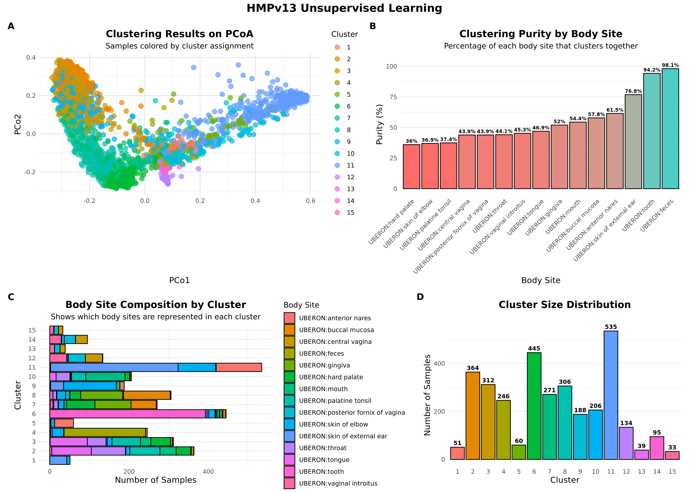
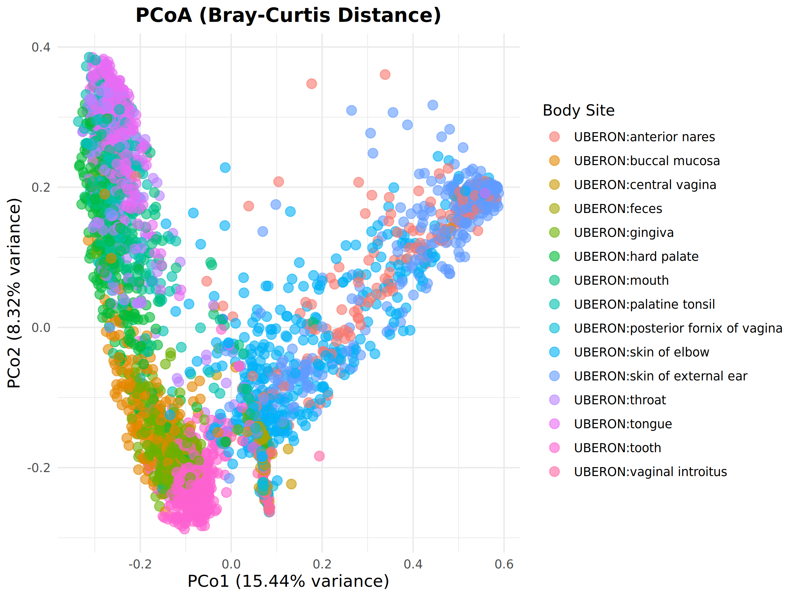
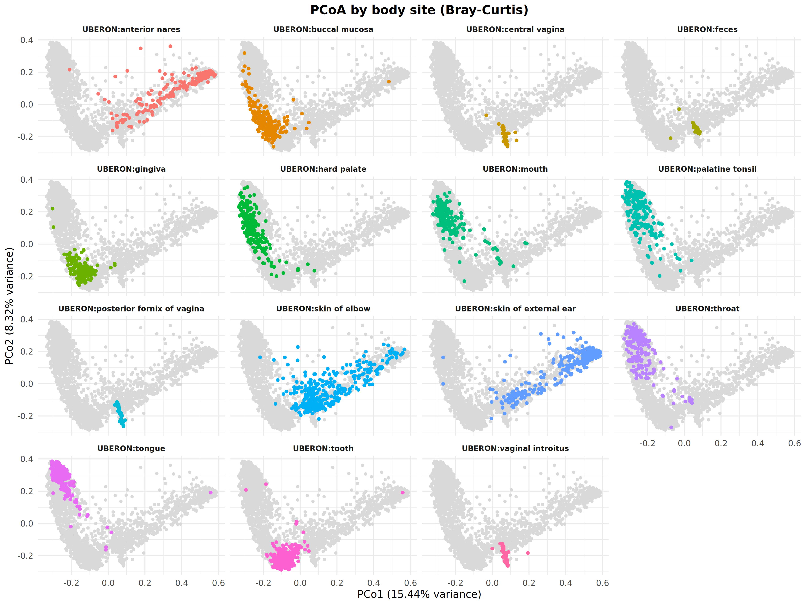
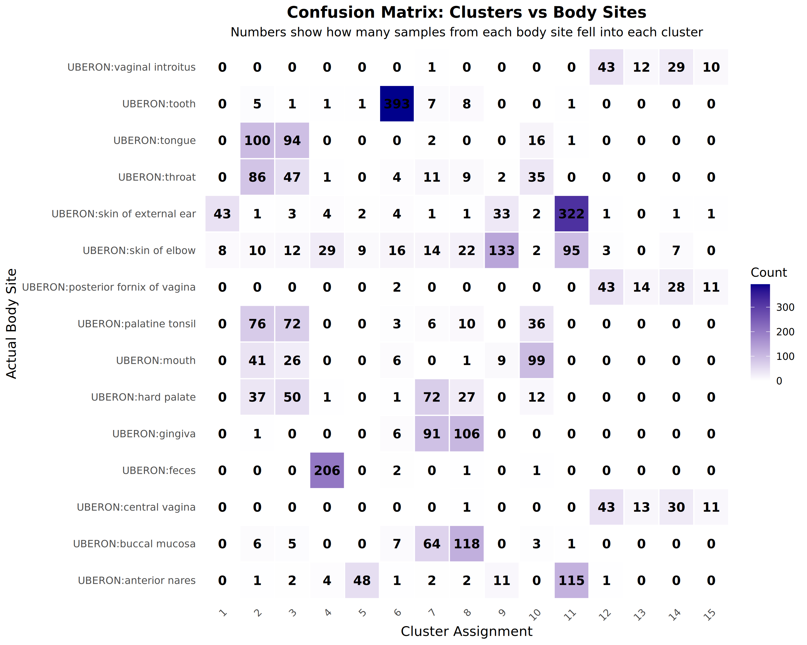
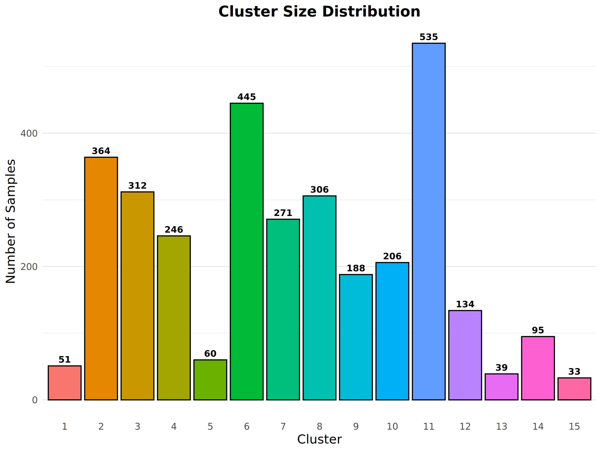
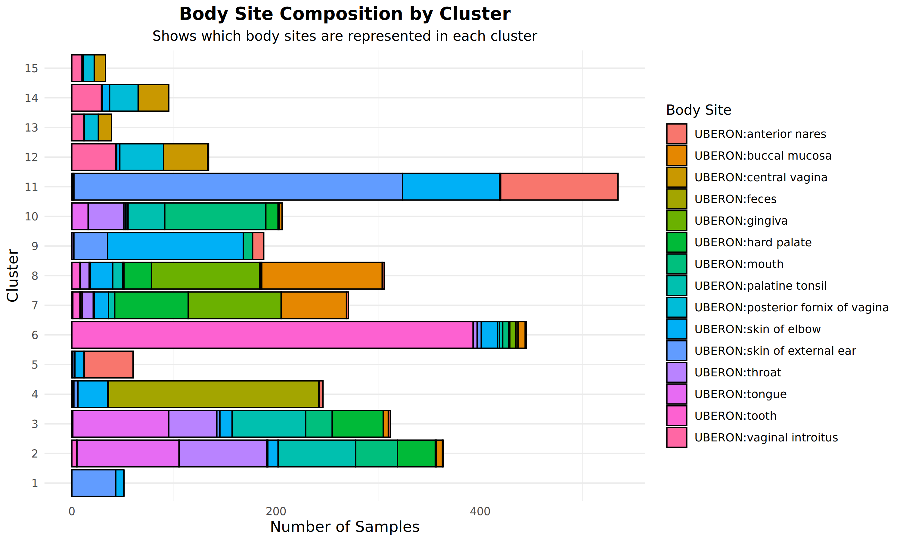
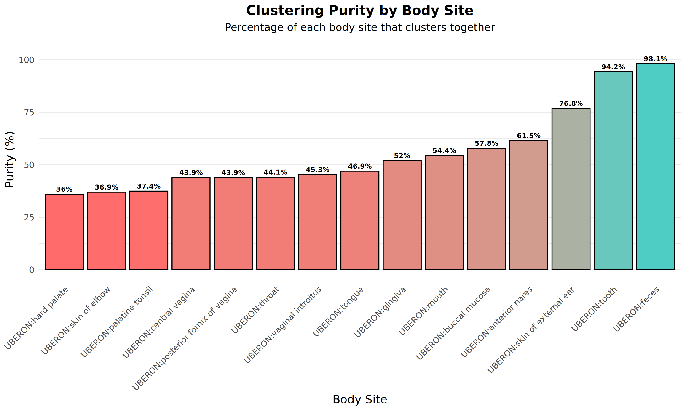

# Unsupervised Learning of Microbial Community Structure by Body Site

**Author:** Nkiruka Cynthia Efenji  
**Dataset:** HMPv13; Human Microbiome Project (16S rRNA, V1–V3 region)  
**Tools:** R · phyloseq · vegan · cluster · ggplot2 · here · dplyr · reshape2 · cmdscale · pam  
**Project type:** Exploratory bioinformatics · Unsupervised machine learning 


*Panels: (A) PCoA coloured by body site, (B) cluster size distribution, (C) body site composition by cluster, (D) purity by body site. Clustering by PAM (k = 15) on Bray-Curtis dissimilarities.*

---

## Background and Motivation

The human body is not a single environment. Every surface; skin, gut, mouth, vaginal tract,
nasal passages, hosts a microbial community shaped by the local conditions it lives in: pH,
oxygen availability, nutrient composition, immune pressure. The **Human Microbiome Project (HMP)**
characterised these communities across healthy adults using 16S rRNA amplicon sequencing,
producing one of the most comprehensive human microbiome reference datasets in existence.

This project applies unsupervised learning to ask a deceptively simple question:

> *Without being told where a sample came from, can the microbial data alone recover body-site identity?*

If the answer is yes...if microbial communities are sufficiently site-specific to cluster
without supervision...it validates the ecological principle of **niche specificity** and has
direct implications for microbiome-based diagnostics, antimicrobial resistance (AMR)
surveillance, and clinical interpretation of microbiome data.

A second question follows: does what we *see* on a two-dimensional ordination plot match what
can be *measured*? Tight, well-separated groups on a PCoA are often read as evidence of a distinct
community, so this project compares visual separation with a quantitative clustering metric
(purity) computed directly on the full dissimilarity matrix.

---

## Dataset

| Feature | Detail |
|---|---|
| Source | `MicrobeDS` R package - `HMPv13` object |
| Sequencing | 16S rRNA amplicon, V1–V3 hypervariable region |
| Samples | 3,285 samples |
| Body sites | 15 UBERON-annotated anatomical sites |
| Taxonomic level | OTU (Operational Taxonomic Units) |

**Body sites (UBERON ontology):**

anterior nares · buccal mucosa · central vagina · feces · gingiva · hard palate · mouth ·
palatine tonsil · posterior fornix of vagina · skin of elbow · skin of external ear ·
throat · tongue · tooth · vaginal introitus

UBERON (Uber Anatomy Ontology) standardises body site terminology across databases and
species, ensuring that results from this analysis are comparable with microbiome studies
globally. This is a core open science principle.

---

## Analytical Workflow

```
HMPv13 phyloseq object
        │
        ▼
  Data exploration
  (ntaxa, nsamples, body site distribution)
        │
        ▼
  OTU table extraction + transpose
  (samples as rows, OTUs as columns)
        │
        ▼
  Prevalence filtering
  (remove OTUs with total count ≤ 10)
        │
        ▼
  Relative abundance normalisation
  (each sample sums to 1)
        │
        ▼
  Log transformation — log1p(relative abundance)
  (stabilise variance, reduce skew)
        │
        ▼
  Bray-Curtis dissimilarity matrix
  (3,285 × 3,285 pairwise distances — vegan::vegdist)
        │
        ├─────────────────────────────────────────┐
        ▼                                         ▼
  PCoA — cmdscale(k=2)                Partitioning around medoids
  2D projection of community           cluster::pam(diss = TRUE), k=15
  structure                          (suited to non-Euclidean distances)
                                                  │
                                 ┌──────────┼──────────┬──────────┐
                                 ▼          ▼          ▼          ▼
                           Confusion   Cluster    Body site   Purity
                           matrix      size       composition metric
                           heatmap     distribution by cluster 
                                  
```

---

## Methods

### Preprocessing

Raw OTU count data from 3,285 samples required three preprocessing steps before any distance 
calculation:

**1. Prevalence filtering** - OTUs with a total count ≤ 10 across all samples were removed. 
This eliminates low-abundance taxa that contribute noise rather than biological signal, and 
reduces dimensionality before distance computation.

**2. Relative abundance normalisation** - Each sample's counts were divided by its total count, 
converting raw reads to proportions. This is essential because samples were sequenced at 
different depths: a count of 500 reads of taxon X means something very different in a sample 
with 1,000 total reads versus one with 50,000.

**3. Log transformation** -  `log1p()` (i.e., log(x + 1)) was applied to relative abundance 
values. Microbiome data is heavily right-skewed — most taxa are rare, a few are very abundant.
Log transformation compresses this skew and stabilises variance, improving the performance of
both distance metrics and clustering.


### Beta Diversity - Bray-Curtis Dissimilarity

Beta diversity quantifies how different microbial communities are *between* samples.
**Bray-Curtis dissimilarity** was chosen because it:

- Is bounded between 0 (identical communities) and 1 (completely different)
- Accounts for both presence/absence *and* relative abundance of taxa
- Is robust to the compositional nature of sequencing count data
- Is the standard metric used in the original HMP papers and across human microbiome literature

The full 3,285 × 3,285 distance matrix was computed using `vegan::vegdist()` and saved as
an `.rds` object, enabling reuse across downstream scripts without recomputation.


### Dimensionality Reduction - PCoA

With thousands of OTUs and 3,285 samples, the data cannot be directly visualised.

**Principal Coordinates Analysis (PCoA)** - metric multidimensional scaling, takes the
Bray-Curtis distance matrix and projects it into 2D while preserving as much of the original
distance structure as possible.

Computed using `cmdscale(k = 2, eig = TRUE)`. The eigenvalues were used to calculate the
percentage of total variance explained by each axis:

- **PCo1: 15.44%** - primarily separates skin from mucosal communities

- **PCo2: 8.32%** - further separates vaginal from oral communities within the mucosal group
  
- **Combined: 23.76%** - typical for high-dimensional microbiome data, where variance is
  genuinely distributed across many biological axes
  

### Clustering - Partitioning Around Medoids (PAM)

**Partitioning around medoids (PAM, k-medoids)** groups samples around representative
"medoid" samples, choosing the k medoids that minimise the total dissimilarity between each
sample and its nearest medoid. Unlike k-means, PAM works directly on a dissimilarity matrix
and does not require Euclidean coordinates, which makes it well suited to ecological distances
such as Bray-Curtis. Because medoids are actual samples, the clusters are also less sensitive
to outliers.

PAM was run on the full 3,285 × 3,285 Bray-Curtis matrix (`cluster::pam(diss = TRUE)`), not
on the 2D PCoA coordinates, so the clustering uses all of the distance information rather than
the two axes shown in the plots. PAM's default initialisation is deterministic, so the results
are reproducible without setting a random seed.

The number of clusters was set to **k = 15**, matching the number of body sites, to test 
whether the algorithm recovers biologically meaningful groupings without access to metadata.
Note that k=15 is an assumption rather than an empirically optimised choice, silhouette 
analysis to determine optimal k is planned for Phase 2.


### Cluster Evaluation - Purity Metric

To evaluate whether recovered clusters correspond to real body-site groupings, a
**purity score** was computed for each body site: the proportion of that site's samples that
fall in the single cluster containing most of them.

A purity of 100% means every sample from that body site was assigned to the same cluster. 
This is a standard unsupervised learning evaluation metric requiring only cluster assignments 
and known ground truth, no predicted class labels needed.

Purity is calculated per body site, so it does not penalise a cluster that mixes several
sites. It should be read alongside the confusion matrix, which shows which sites share a
cluster.


---

## Results

### PCoA: Bray-Curtis Distance



Each point is one sample; colour indicates body site. Body site labels are applied post-hoc;
the ordination is driven entirely by microbial composition.

With 15 body sites and similar hues, points overlap heavily in a single panel. The same
ordination is therefore also shown with one body site highlighted per panel (all other samples
in grey):



**Key observations**:

- **Oral sites** occupy the left arm of the plot and split into two regions. Tongue, throat, 
  palatine tonsil, hard palate and mouth overlap heavily in the upper left, while gingiva, 
  tooth and buccal mucosa sit lower on the same arm.

- **Vaginal sites** (central vagina, posterior fornix, vaginal introitus) all occupy one small, 
  tight region at the bottom of the plot, on top of one another. Each site is compact, but 
  the three cannot be distinguished by position.

- **Feces** forms a small, compact cluster in the lower centre, close to but distinct from 
  the vaginal region and separate from the oral arm.

- **Skin sites**: external ear is concentrated at high PCo1 values (upper right), while elbow 
  spreads more broadly from the centre towards the same region.

- **Anterior nares** scatter along the same arm as the skin sites, overlapping them, with a 
  few outlying samples towards the top of the plot.

Axis interpretation: PCo1 (15.44%) runs from oral communities (left) to skin communities
(right). PCo2 (8.32%) spreads samples along the vertical axis of a horseshoe-shaped
ordination, a common pattern when communities change along strong compositional gradients.
No single site is isolated by PCo2 alone.

**Caution:** a compact group on a 2D ordination does not mean the group is distinguishable
from its neighbours. The three vaginal sites are each tight, yet they overlap almost
completely. The two axes also capture only 23.76% of the variance, and overplotting hides 
samples. Quantitative separation is assessed by clustering purity (see the Clustering Purity section).

---

### Confusion Matrix Heatmap



This heatmap cross-tabulates cluster assignments (columns) against actual body site labels 
(rows). Darker cells = more samples at that intersection. A perfect algorithm would show one 
dominant dark cell per row.

**Key observations**:

- **Feces** gives the cleanest result: 206 of 210 samples fall in cluster 4 (98.1% purity),
  with minimal scatter. The gut community is compositionally distinct enough that PAM isolates
  it almost completely.

- **Tooth** contains the largest single cell in the matrix: 393 of 417 samples (94.2%) fall in 
  cluster 6, a very well-defined microbial group.

- **Skin of external ear** is mostly captured by cluster 11 (322 of 419 samples), with smaller
  groups in cluster 1 (43) and cluster 9 (33).

- **Vaginal sites** (central vagina, posterior fornix, vaginal introitus) each split across the 
  same four clusters (12-15) in near-identical proportions; cluster 12 holds 43 samples from 
  each site. Clusters therefore reflect shared community types rather than anatomical site, and 
  the three sites cannot be told apart by clustering (purity 44-45%), even though each site 
  looks compact on the PCoA.

- **Oral sites** share clusters with one another rather than each having its own. Tongue, throat, 
  palatine tonsil and hard palate spread mainly across clusters 2 and 3; gingiva and buccal 
  mucosa share clusters 7 and 8; mouth falls mostly in cluster 10. Only tooth is cleanly 
  isolated. Hard palate has the lowest purity in the dataset (36%).

- **Skin of elbow** splits between cluster 9 (133 samples) and cluster 11 (95 samples), the 
  latter shared with external ear and anterior nares.

- **Anterior nares** falls mainly in cluster 11 (115 of 187 samples), shared with skin of 
  external ear and elbow, consistent with the known overlap between nasal and skin-associated 
  communities. A further 48 samples form a small, mostly nares-specific cluster (cluster 5).

Overall, PAM cleanly separates a few sites (feces, tooth, and largely external ear), while sites 
in the same body region (oral, vaginal, skin/nares) share clusters. High purity therefore 
depends on the site rather than on how compact it appears on the PCoA (see the PCoA section).


---

### Cluster Size Distribution



This bar chart shows the number of samples assigned to each of the 15 PAM clusters.

**Key observations**:

- **Cluster sizes are unequal**, ranging from 33 samples (cluster 15) to 535 samples 
  (cluster 11), roughly a 16-fold difference.

- **Cluster 11 is the largest (535)** and is shared by several sites: skin of external ear 
  (322), anterior nares (115) and skin of elbow (95), consistent with the overlap seen in 
  the confusion matrix.

- **Cluster 6 (445)** is almost entirely tooth (393 samples), and **cluster 4 (246)** is 
  mostly feces (206 samples).

- **Clusters 12-15 (134, 39, 95, 33)** are the small clusters that hold the vaginal samples, 
  which split across these four clusters in near-identical proportions for all three 
  vaginal sites.

- **Clusters 1 (51) and 5 (60)** are the other small clusters: cluster 1 is mostly skin of 
  external ear (43 samples) and cluster 5 is mostly anterior nares (48 samples).

- **Clusters 2, 3, 7, 8, 9 and 10 (188-364 samples)** are mid-sized and capture the oral sites, 
  which share clusters with one another rather than each having their own.

Cluster size reflects both how many samples each body site contributes and how communities 
within a site split into sub-groups. It is not a quality measure on its own, cluster 
composition (confusion matrix) and per-site purity are more informative.


---

### Body Site Composition by Cluster



This horizontal stacked bar chart shows which body sites contribute to each PAM cluster. 
A single dominant colour means the cluster is mostly one site; several colours of similar 
width mean mixed membership. This is a cluster-level view: it asks what each cluster contains, 
whereas purity asks where each site's samples went.

**Key observations**:

- **Cluster 6 (445 samples)** is the most site-specific large cluster: 393 samples (88%) are tooth.

- **Cluster 4 (246)** is mostly feces (206 samples, 84%), with a smaller block of skin of elbow 
  (29 samples).

- **Cluster 1 (51)** is mostly skin of external ear (43 samples, 84%), with the remainder skin of 
  elbow.

- **Cluster 5 (60)** is mostly anterior nares (48 samples, 80%), with smaller blocks of 
  skin of elbow (9) and skin of external ear (2).

- **Cluster 9 (188)** is mostly skin of elbow (133 samples, 71%), with a secondary block of 
  skin of external ear (33).

- **Cluster 11 (535)**, the largest, is a mixed skin/nares cluster: skin of external ear (322 
  samples, 60%), anterior nares (115) and skin of elbow (95).

- **Clusters 12-15** are the vaginal clusters. Each contains central vagina, posterior fornix 
  and vaginal introitus in near-equal shares (for example, cluster 12 holds 43 samples of each 
  site), and almost no non-vaginal samples. The three vaginal sites therefore separate 
  cleanly from other body sites but not from each other.

- **Clusters 2, 3, 7, 8 and 10** are the oral clusters, and all are mixed. Cluster 2 (364) 
  and cluster 3 (312) combine tongue, throat, palatine tonsil, hard palate and mouth; 
  cluster 7 (271) combines gingiva, hard palate and buccal mucosa; cluster 8 (306) is mostly 
  buccal mucosa and gingiva; cluster 10 (206) is about half mouth (99 samples) with 
  palatine tonsil, throat and tongue.

- **Clusters 2 and 3 are the most mixed**: the largest single site makes up only 27.5% of 
  cluster 2 (tongue) and 30.1% of cluster 3 (tongue).

Overall, PAM produces site-specific clusters for tooth, feces and (largely) external ear and 
nares, but oral sites share clusters with one another, skin and nares samples share clusters 
with each other, and the three vaginal sites cannot be told apart. Clusters therefore tend to 
follow shared community types within a body region rather than individual anatomical sites.

---

### Clustering Purity by Body Site



This is the quantitative core of the analysis. Purity is computed for each body site as the 
percentage of its samples assigned to that site's most frequent cluster. Body sites are ordered 
left to right by ascending purity; colour encodes purity (red = lower, teal = higher). Values 
are saved in `results/clustering_quality_metrics.csv`.

**Key observations**:

- **Feces** achieves the highest purity at 98.1%: 206 of 210 gut samples fall in a single 
  cluster (cluster 4). It is the most recoverable community in the dataset.

- **Tooth** (94.2%) is the only other site above 90%. **Skin of external ear** (76.8%) comes 
  next, with a substantial share of its samples in cluster 11.

- **Anterior nares** (61.5%), **buccal mucosa** (57.8%), **mouth** (54.4%) and **gingiva** 
  (52.0%) are moderate. Each shares its most frequent cluster with other sites 
  (nares with skin; buccal mucosa and gingiva with each other, cluster 8).

- **Tongue** (46.9%), **throat** (44.1%) and **palatine tonsil** (37.4%) score low; all three 
  share their most frequent cluster (cluster 2), so the algorithm does not separate them.

- **Vaginal sites** score low: vaginal introitus (45.3%), central vagina (43.9%) and posterior 
  fornix (43.9%). All three have the same most frequent cluster (12) and split across the same 
  four clusters (12-15), so purity is low because the sites are interchangeable in community 
  composition, not because samples are scattered at random.

- **Skin of elbow** (36.9%) and **hard palate** (36.0%) are the lowest, together with palatine 
  tonsil (37.4%). Their samples are spread across several clusters.

Purity does not track visual compactness on the PCoA. The vaginal sites look tight in the 
ordination but score less than half as high as feces. Two sites with similar visual compactness 
can therefore differ sharply in how distinguishable they are quantitatively, which supports 
reporting a separation metric alongside ordination plots.

**Limits**: purity treats body-site labels as ground truth, depends on k (fixed here at 15, the 
number of sites, not optimised), and rewards large numbers of small clusters, so it should be 
read together with the confusion matrix. Explanations for why particular sites cluster well 
(for example the distinct ecology of tooth surfaces) are hypotheses from the literature, not 
results of this analysis.

---

## Summary of Findings

| Body site (group) | PCoA position | Clustering purity | What the analysis shows |
|---|---|---|---|
| Feces | Compact, lower centre | 98.1% | 206 of 210 samples in one cluster (4); the most recoverable community |
| Tooth | Compact, bottom of plot | 94.2% | 393 of 417 samples in one cluster (6) |
| Skin of external ear | Concentrated at high PCo1 (upper right) | 76.8% | Mostly cluster 11, shared with anterior nares and skin of elbow |
| Anterior nares | Spread along the skin arm, overlapping skin | 61.5% | Mostly cluster 11; a further 48 samples form a small nares-specific cluster (5) |
| Buccal mucosa, gingiva | Lower part of the oral arm | 57.8%, 52.0% | Share cluster 8 |
| Mouth | Upper left, oral arm | 54.4% | About half in cluster 10 |
| Tongue, throat, palatine tonsil | Upper left, overlapping | 46.9%, 44.1%, 37.4% | Share cluster 2 and cannot be separated from one another |
| Vaginal sites (three) | Compact, bottom centre, overlapping | 43.9-45.3% | Same four clusters (12-15) in near-identical proportions; separate from other sites, not from each other |
| Skin of elbow | Broad, centre to upper right | 36.9% | Split between cluster 9 (133) and cluster 11 (95) |
| Hard palate | Upper left, spread down the oral arm | 36.0% | Lowest purity; samples spread across several clusters |

**Headline result:** visual compactness on the PCoA does not predict quantitative separation.
Feces is compact and 98.1% pure. The three vaginal sites are just as compact but score only
43.9-45.3%, because they occupy the same region of the ordination and share the same
community types, so PAM (k = 15) cannot tell them apart. Two-dimensional ordination can
therefore overstate how distinguishable groups are, which motivates reporting a quantitative
separation metric alongside ordination plots. Because k was fixed at the number of body sites, 
this result should be re-tested with an independently chosen k (Phase 2).

---

## Limitations and Next Steps

**Current limitations:**

- k = 15 was set to match the number of body sites; the optimal k was not determined
  independently, and silhouette analysis may reveal a different structure.

- Purity treats body-site labels as ground truth and is calculated per site, so it is lowered
  when different sites share the same community types. It also tends to rise as k increases.

- The reason vaginal sites share clusters is not yet characterised: which taxa define
  clusters 12-15 is unknown.

- If the HMP samples include repeated visits from the same individuals, samples are not
  independent, which matters for any formal statistical test.

- Alpha diversity (within-sample richness) not yet computed; Shannon and Chao1 per body site
  would complement the beta diversity picture.

- No formal statistical test of community differences beyond the purity metric.

- Taxonomic decomposition of clusters not yet performed; which genera drive each cluster's
  identity remains unknown.

**Planned Phase 2 analyses:**

- [ ] Silhouette analysis on the PAM solution; determine optimal k independently of body site count

- [ ] PERMANOVA; formal statistical test of body-site differences (`vegan::adonis2`), with a
  dispersion check (`vegan::betadisper`)

- [ ] Adjusted Rand Index; objective cluster recovery metric

- [ ] Supervised classification; random forest to predict body site from OTU composition

- [ ] Differential abundance; identify most discriminative OTUs between body sites

- [ ] Alpha diversity; Shannon and Chao1 per body site

- [ ] Taxonomic barplots per cluster; genus-level decomposition, starting with clusters 12-15

---

## Analysis Notebook

The full annotated analysis, including all code, outputs, and commentary is available as a 
rendered HTML report:

[View Full Analysis Notebook](https://nkiruka-cynthia.github.io/hmpv13-microbiome-analysis/reports/hmpv13_analysis.html)

---

## Reproducibility

All scripts use `here` for reproducible relative file paths. The analysis is fully re-runnable
from the raw `.rda` data file. PAM's default initialisation is deterministic, so clustering 
results are reproducible without setting a random seed.

```
hmpv13-microbiome-analysis/
├── README.md
├── hmpv13-microbiome-analysis.Rproj
├── data/
│    └── HMPv13.rda
├── reports/
│    ├── hmpv13_analysis.Rmd
│    └── hmpv13_analysis.html
├── results/
│    ├── otu_filtered_raw.rds
│    ├── otu_processed.rds
│    ├── metadata.rds
│    ├── bray_curtis.rds
│    ├── pcoa_coordinates.csv
│    ├── clustering_summary.csv
│    ├── confusion_matrix.csv
│    └── clustering_quality_metrics.csv
└── figures/
     ├── pcoa_plot.png
     ├── pcoa_by_site_facets.png
     ├── clustering_clusters_only.png
     ├── confusion_matrix_heatmap.png
     ├── cluster_size_distribution.png
     ├── body_site_by_cluster.png
     ├── clustering_purity.png
     └── figure_panel.png
```


---

## References

- The Human Microbiome Project Consortium. Structure, function and diversity of the healthy 
  human microbiome. Nature 486, 207–214 (2012) https://doi.org/10.1038/nature11234
- Asnicar, F., Thomas, A., Passerini, A. et al. Machine learning for microbiologists. 
  Nat Rev Microbiol 22, 191–205 (2024). https://doi.org/10.1038/s41579-023-00984-1
- Kaufman, L. & Rousseeuw, P. Finding Groups in Data: An Introduction to Cluster Analysis. 
  Wiley (1990). https://doi.org/10.1080/02664763.2023.2220087
- Battaglia, T. (2024). A repository for large-scale microbiome datasets, formatted for 
  phyloseq. https://github.com/twbattaglia/MicrobeDS
- [UBERON Ontology](https://obophenotype.github.io/uberon/)
 


